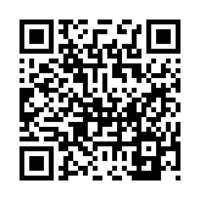

QR Code Generator

🔗 Google Colab Link

[Open in Google Colab](https://colab.research.google.com/drive/1WN9GBOrycKPoP7j3hmM3TiEQMDqy4fKd?usp=sharing)

📌 Overview

This project generates QR codes using Python's qrcode library. The QR codes can be customized with different error correction levels, box sizes, and borders. The generated QR code is saved as an image file.

🛠️ Requirements

Make sure you have the following dependencies installed:

Python 3.x

qrcode[pil]

# Install required libraries (if not install)
!pip install qrcode[pil]

import qrcode as qr
from PIL import Image

img= qr.make("https://www.youtube.com/watch?v=eDIj5LuIL4A")

qr= qrcode.QRCode(version=1,
error_correction=qrcode.constants.ERROR_CORRECT_H,
box_size=15, border=10,)

img.save("YouTube.png")

